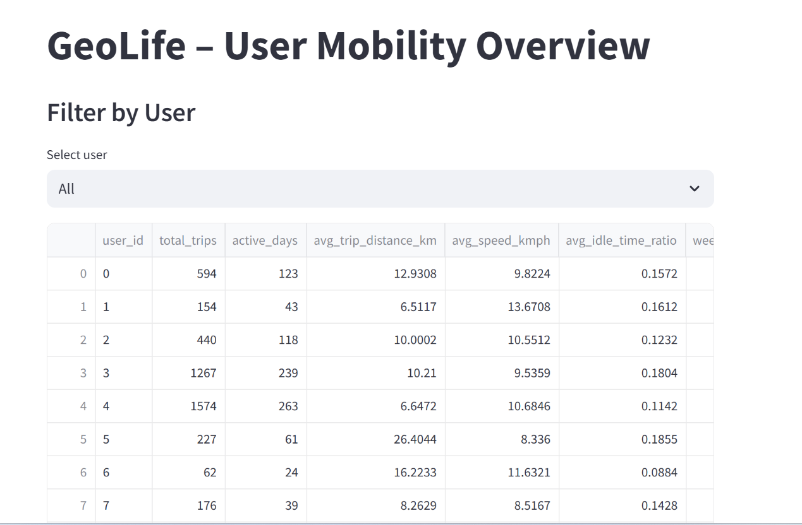
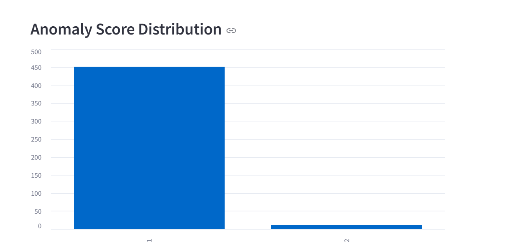

# GeoLife Mobility Analytics

An end-to-end, SQL-first mobility analytics project built on the GeoLife GPS Trajectory dataset.  
The project engineers trip- and user-level features in PostgreSQL, applies rule-based anomaly detection, and exposes insights through an interactive Streamlit dashboard.

## Architecture
- **Data**: GeoLife GPS Trajectories
- **Storage & Analytics**: PostgreSQL (staging → marts)
- **Processing**: SQL + Python
- **Visualization**: Streamlit
- **Config**: Environment variables via `.env`

## Features
- Trip-level feature engineering (distance, duration, speed, idle ratio)
- User-level mobility summaries (active days, averages, ratios)
- Rule-based anomaly detection
- Interactive dashboard with user drill-down and anomaly filtering

## Project Structure
geolife-mobility-analytics/
├── app/
│ ├── app.py
│ ├── db.py
│ └── queries.py
├── notebooks/
├── data/
├── .env
├── .gitignore
└── README.md

## How to Run
1. Create a `.env` file in the project root:
DB_USER=postgres
DB_PASSWORD=your_password
DB_HOST=localhost
DB_PORT=5432
DB_NAME=geolife

Install dependencies:
pip install streamlit sqlalchemy psycopg2-binary python-dotenv pandas

Run the app:
streamlit run app/app.py

## Dashboard
- User-level overview with filters
- Trip anomaly table with severity slider
- Anomaly score distribution chart

## Notes
- Logic validated on a subset before scaling
- SQL remains the source of truth; UI is thin by design
### Screenshots

